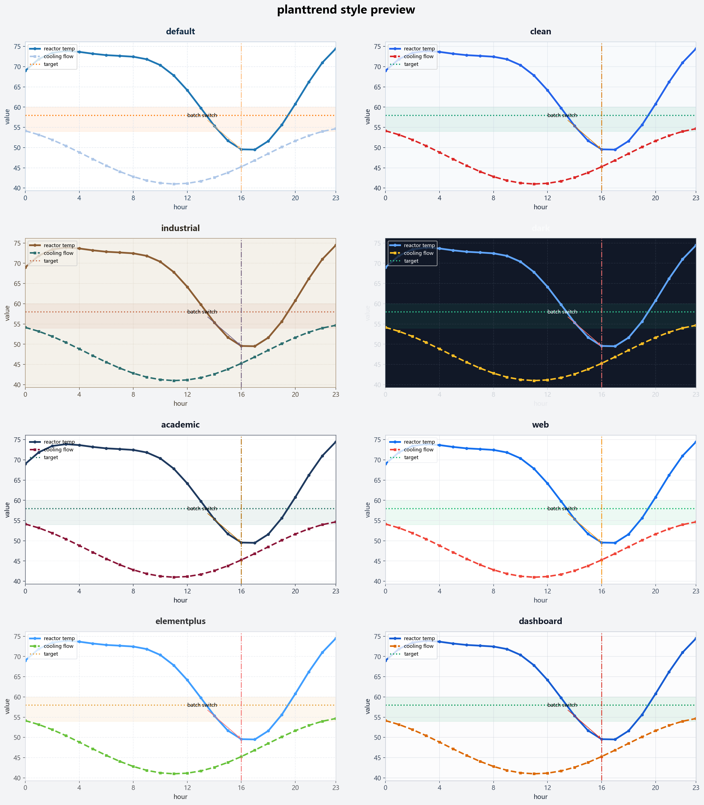

# planttrend

planttrend is a lightweight plotting helper library built on top of pandas and matplotlib. It is aimed at industrial process data analysis, time-series trend comparison, correlation inspection, and label/style reuse.

## Features

- Multi-axis trend plotting for process variables
- Correlation heatmaps for numeric columns
- Distribution comparison charts
- Reusable label maps for equipment tags and aliases
- Built-in style presets for dashboards, reports, and industrial scenes

## Install

```bash
pip install planttrend
```

## Quick start

```python
import pandas as pd
from planttrend import plot_columns, plot_correlation_heatmap, plot_distribution

frame = pd.read_csv("example.csv")

plot_columns(
    frame,
    columns=[["TE301101H.AI1.PV"], ["LT301101H.AI1.PV", "FT301101H.AI1.PV"]],
    x="时间",
    style="industrial",
)

plot_correlation_heatmap(frame)
plot_distribution(frame, columns=["FT301101H.AI1.PV", "FT301103H.AI1.PV"])
```

## Style preview



Regenerate the preview image with:

```bash
python tests/render_style_preview.py
```

## Development

```bash
python -m pip install -U build twine
python -m build
```

The generated artifacts will be placed in the dist directory.

## GitHub Actions release

This repository includes an automated publish workflow at .github/workflows/publish.yml.

Before using it:

1. Create a PyPI API token.
2. In GitHub, open Settings > Secrets and variables > Actions.
3. Add a repository secret named PYPI_API_TOKEN.
4. Keep the version in pyproject.toml aligned with the Git tag you plan to push.

### Automatic publish by tag

Update the package version first, then push a tag in the form v0.1.0:

```bash
git tag v0.1.0
git push origin v0.1.0
```

The workflow will run tests, build the package, validate the artifacts, and upload them to PyPI.

### Manual run from GitHub

You can also run the workflow from the Actions tab with workflow_dispatch.
If you leave publish_to_pypi unchecked, it only runs test and build validation.
If you check publish_to_pypi, it will also upload dist artifacts to PyPI.
